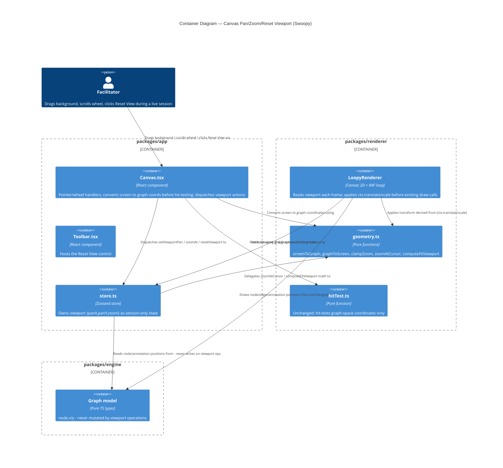

# Architecture Brief — For Acceptance Designer

This document names the driving ports (acceptance test entry points) for each package.
It is a pointer document — the full architecture lives in `docs/ARCHITECTURE.md`.

---

## Package map

```text
packages/
  engine/     Pure TypeScript. No browser or framework dependencies.
  renderer/   Canvas 2D + RAF loop. Browser only. Not imported in tests.
  app/        React + Vite. Zustand store. UI components. Persistence.
```

---

## Driving ports

### engine — pure function ports

All engine behavior is exercised through exported pure functions. No harness, no DOM, no mocks required.

| Port                      | Signature                                                          | What acceptance tests attach here                                    |
| ------------------------- | ------------------------------------------------------------------ | -------------------------------------------------------------------- |
| `inject`                  | `inject(sim, graph, nodeId, strength) → SimState`                  | Signal injection: value change + relay emission                      |
| `step`                    | `step(graph, sim, dt) → SimState`                                  | Full tick: constraint pre/post clamp, signal advance, arrival, relay |
| `computeEffectiveWeights` | `computeEffectiveWeights(graph, nodeValues) → Map<EdgeId, number>` | Modulator scaling formula                                            |
| `makeInitialSim`          | `makeInitialSim(graph) → SimState`                                 | Initial state from graph                                             |
| `serialize`               | `serialize(graph) → SerializedGraph`                               | Graph → versioned JSON                                               |
| `deserialize`             | `deserialize(blob) → Graph`                                        | Versioned JSON → Graph; throws on unknown version                    |

**All exported from** `packages/engine/src/index.ts`.

Test file placement: `packages/engine/src/*.test.ts` (co-located per project convention).

---

### app/store — Zustand store actions

App-level behavior is exercised through the Zustand store. Tests construct store state and call actions directly — no rendering required.

| Port                                      | What acceptance tests attach here                       |
| ----------------------------------------- | ------------------------------------------------------- |
| `addNode`, `addEdge`, `addConstraintEdge` | Graph mutation + undo stack recording                   |
| `deleteNode`, `moveNode`, `nudgeNode`     | Structural mutations + undo                             |
| `inject(nodeId, strength)`                | Store-level injection (wraps engine inject)             |
| `tickSim(dt)`                             | Store-level step (wraps engine step)                    |
| `undo`, `redo`                            | Undo stack traversal                                    |
| `addModulator`, `toggleModulatorPolarity` | Modulator lifecycle                                     |
| `newModel`                                | UUID generation, localStorage, URL replaceState (SE-09) |

**Defined in** `packages/app/src/store.ts`.

Test file placement: `packages/app/src/store.test.tsx` and `packages/app/src/store.test.ts` (existing).

---

### app/persistence — URL + localStorage layer

Persistence behavior is exercised through the store's startup/mutation hooks and URL param parsing. Tests use jsdom's localStorage and control `window.location.search`.

| Port                              | Acceptance boundary                                                                     | PRD ref |
| --------------------------------- | --------------------------------------------------------------------------------------- | ------- |
| Auto-save on mutation             | Every graph mutation calls `serialize → localStorage.setItem('swoopy_graph_<id>', ...)` | SE-07   |
| Restore from `?m=<id>`            | On load, reads `swoopy_graph_<id>` from localStorage                                    | SE-08   |
| Transient load from `?g=<base64>` | Deserialises without persisting; first mutation forks a new UUID                        | SE-08   |
| Legacy key migration              | `swoopy_graph` → `swoopy_graph_<generated-id>`, URL updated to `?m=<id>`                | SE-08   |
| New model action                  | Generates UUID, clears graph, updates `?m=`, preserves old model in localStorage        | SE-09   |
| Welcome overlay                   | Shown when no `swoopy_current_model` and no `?g=`/`?m=` params; dismissed by CTA        | SE-10   |

**Key tests:** `packages/app/src/persistence.integration.test.ts`, `packages/app/src/share-compression.integration.test.ts`.

---

### scripts/ — agent-facing encode CLI

Standalone Node CLI, not part of any package — invoked directly (by an AI agent or a human) to turn a hand-built graph JSON into a share URL without going through the app UI. Added by the `swoopy-diagram-agent-authoring` feature; mirrors `scripts/decodeSharedModelURL.js`'s existing reimplementation pattern (Node builtin `zlib`, not a `packages/app/src/url-encoding.ts` import — see `docs/product/architecture/adr-001-encode-script-reimplements-pipeline.md`).

| Port | Signature | What acceptance tests attach here |
| --- | --- | --- |
| `node scripts/encodeSharedModelURL.js <file> [--title <text>]` | CLI. stdout = `?g=...&title=...` on success (exit 0); stderr + non-zero exit on an invalid graph, no URL printed | Real subprocess invocation via `execFileSync` — not an imported function call |

**Defined in** `scripts/encodeSharedModelURL.js`.

Test file placement: `scripts/encodeSharedModelURL.test.js` (co-located, new `scripts/vitest.config.ts` project).

Agent-facing guidance doc (schema reference, worked example, iteration loop): `docs/AGENT-GRAPH-AUTHORING.md` — see `docs/product/architecture/adr-002-guidance-doc-location.md`.

---

## Constraint: no test touches the renderer

`packages/renderer` is browser-only. Tests that exercise the app/store layer mock the renderer via `vi.mock('@swoopy/renderer', ...)`. The renderer's own pure functions (`stockIndicator`, `timebombStrength`, `saturationAlpha`) are tested directly in `packages/renderer/src/indicators.test.ts`.

---

## Key invariants for acceptance test design

1. **inject() is unclamped** — value change is immediate and may exceed node [min, max]; clamping happens at the next `step()` call.
2. **Constraint resolution runs twice per tick** — pre-clamp (step 1, before arrivals) and post-clamp (step 6, after arrivals). Acceptance tests must distinguish these if testing constraint interaction with signal propagation.
3. **Serialization is versioned at v5** — `deserialize` migrates v1–v4 blobs; `serialize` always emits v5.
4. **Undo does not include sim state** — `inject()` and `tickSim()` are not in the undo stack; only graph structure mutations are.
5. **Transient model flag** — a model loaded from `?g=` is `transient: true` until the first mutation forks it; `persist()` is a no-op while transient.
6. **Encode script self-checks before printing** — `scripts/encodeSharedModelURL.js` decodes its own output and deep-equals it against the input graph before printing a URL; a broken encode is a non-zero exit with no URL, never a silently wrong link.

---

## Application Architecture

Added by DESIGN wave, feature `canvas-pan-zoom-navigation` (Morgan). Extends the package map and
driving-ports tables above — no prior architect's section exists in this brief, so this is the
first `## Application Architecture` entry. See
`docs/feature/canvas-pan-zoom-navigation/feature-delta.md` (`## Wave: DESIGN`) for the full
reuse analysis, rejected alternatives, and rationale; `adr-003`/`adr-004` for the two significant
decisions.

### Viewport: new shared state + pure transform ports

| Port | Owner | Signature | Contract shape |
| --- | --- | --- | --- |
| `Viewport` (type) | `packages/renderer/src/geometry.ts` | `{ panX: number; panY: number; zoom: number }` | Data shape, no behavior |
| `screenToGraph` | `packages/renderer/src/geometry.ts` | `(viewport: Viewport, screenX: number, screenY: number) => { x: number; y: number }` | pure-function (return-only) |
| `graphToScreen` | `packages/renderer/src/geometry.ts` | `(viewport: Viewport, graphX: number, graphY: number) => { x: number; y: number }` | pure-function (return-only) |
| `clampZoom` | `packages/renderer/src/geometry.ts` | `(zoom: number) => number` — clamps to `[ZOOM_MIN, ZOOM_MAX] = [0.5, 4]` | pure-function (return-only) |
| `zoomAtCursor` | `packages/renderer/src/geometry.ts` | `(viewport: Viewport, screenX: number, screenY: number, deltaY: number) => Viewport` | pure-function (return-only); internally uses `clampZoom` |
| `computeFitViewport` | `packages/renderer/src/geometry.ts` | `(nodes: readonly {x,y,radius}[], annotations: readonly {x,y,width,height}[], canvasWidth: number, canvasHeight: number) => Viewport` | pure-function (return-only); guards zero-width/height bounding box (0/1-node cases) with a minimum-extent substitution, result passed through `clampZoom` |
| `LoopyRenderer.draw(state)` | `packages/renderer/src/LoopyRenderer.ts` | `RendererStore` gains a read-only `viewport: Viewport` field; `draw()` applies `ctx.translate(panX,panY); ctx.scale(zoom,zoom)` once per frame, after the existing DPR transform, before all existing `drawXxx()` calls | bounded-change (canvas pixels only, unchanged mutation universe — see ADR-004) |
| `hitTest(graph, x, y)` | `packages/renderer/src/hitTest.ts` | **Unchanged.** Callers convert screen→graph via `screenToGraph` before calling. | pure-function (return-only), unaffected |
| `viewport` (state) | `packages/app/src/store.ts` | `{ panX: 0, panY: 0, zoom: 1 }` default; ephemeral — same category as `dragPosition`/`hoveredEdgeRegion` (ADR: not in undo stack, not persisted, matches D5) | bounded-change: writes only `viewport`, never `graph.nodes[].x/y` |
| `setViewportPan(panX, panY)` | `packages/app/src/store.ts` | `(panX: number, panY: number) => void` | bounded-change |
| `zoomAt(screenX, screenY, deltaY)` | `packages/app/src/store.ts` | `(screenX: number, screenY: number, deltaY: number) => void` — delegates to `zoomAtCursor` | bounded-change |
| `resetViewport(canvasWidth, canvasHeight)` | `packages/app/src/store.ts` | `(canvasWidth: number, canvasHeight: number) => void` — delegates to `computeFitViewport` | bounded-change |

Driving surfaces in `Canvas.tsx`: existing `pointerdown`/`pointermove`/`pointerup` handlers gain a
screen→graph conversion step at every `hitTest()` call site, plus a movement-threshold pan-vs-click
gate for background gestures (ADR-003); a new `wheel` listener (`{ passive: false }`) drives
`zoomAt`; a new "Reset View" control (host TBD by acceptance-designer/crafter — `Toolbar.tsx` is
the precedented location) drives `resetViewport`.

### C4 Container — viewport state flow



No Component (L3) diagram: this feature adds no new module/subsystem — every change lands inside
existing files (`geometry.ts`, `LoopyRenderer.ts`, `store.ts`, `Canvas.tsx`, `Toolbar.tsx`); the
added complexity is control-flow branching within `Canvas.tsx`'s existing pointer-handler
functions, not a new decomposable subsystem.

### External integrations

None. No new dependency, no external API, no network/filesystem/subprocess boundary. The only
browser APIs touched (`ctx.translate`/`ctx.scale`, `getBoundingClientRect`, `devicePixelRatio`,
`wheel`/`pointer*` events) are synchronous, well-specified, and already exercised by the existing
renderer/Canvas.tsx — no new adapter boundary to an environment known to lie (Earned Trust
principle 13 considered and found not applicable: no probe() contract is warranted here).

### Enforcement

No new dependency-cruiser rule needed: this feature does not change the `engine ← renderer ← app`
import direction (viewport math stays inside `packages/renderer`, consumed by `packages/app`,
exactly like the existing `geometry.ts`/`hitTest.ts` exports). When dependency-cruiser is
eventually configured for this project (per project CLAUDE.md, "not yet configured"), the existing
planned rule ("engine may not import from app; app may import from engine") already covers this
feature's boundary — no additional rule required.
