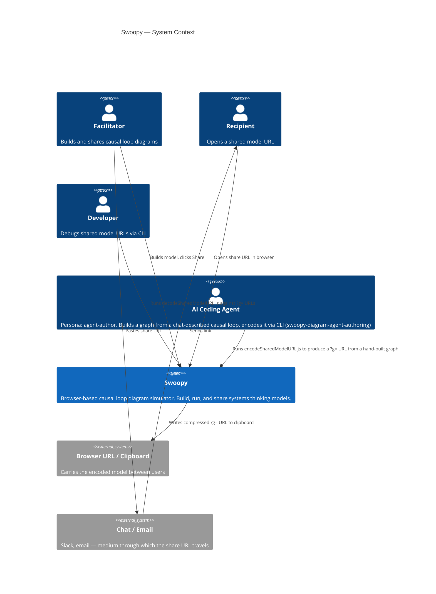
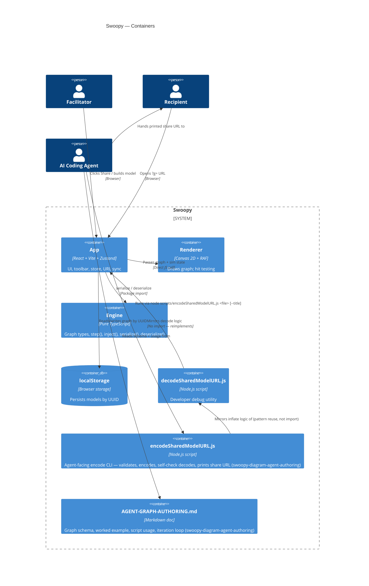
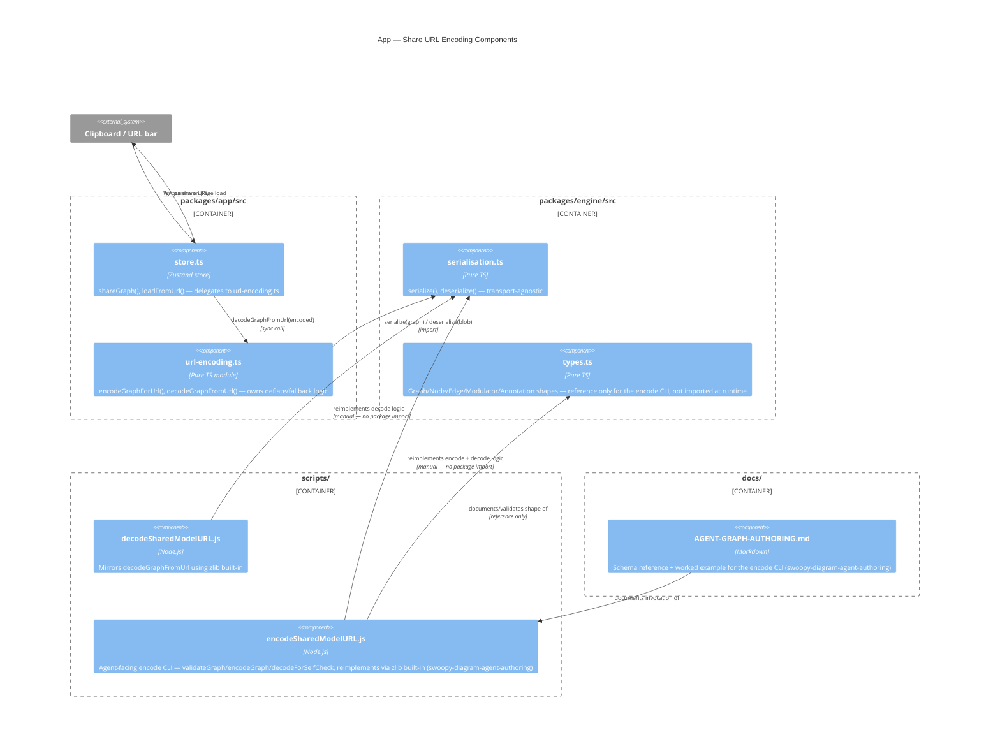

# C4 Diagrams — Swoopy

*Generated during DESIGN wave for share-url-compression (2026-04-24). Extended during DESIGN wave for swoopy-diagram-agent-authoring (2026-07-23) — see additions marked below.*

---

## C4 Level 1 — System Context

---

## C4 Level 2 — Container Diagram

---

## C4 Level 3 — Component Diagram: Share URL Encoding (share-url-compression + swoopy-diagram-agent-authoring)

